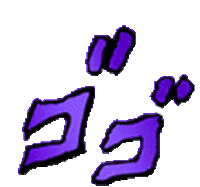

# Kuzan 


**`Backend Developer`** • **`Vim Enjoyer`** • **`Cinema Enthusiast`**

I feel comfortable in the terminal, learning by building, and focusing on simplicity.<br>
Prefers `$EDITOR=vim` over `$EDITOR=nano`.

<br>

###  Languages and Tools


<br>

###  More about me...

```lua
function M.kuzan()
    return {
        currently_learning = {
            active = { "Typescript", "Go", "Neovim Plugin" },
            pending = { "Rust", "Docker", "DSA" }
        },
        skills = {
            frontend = { "html", "css", "scss", "js", "react", "vue" },
            backend = { "lua", "nodejs", "express", "go", "fiber", "php" },
            tools = { "git", "vim", "neovim", "nix", "nixos", "arch", "supabase", "postgres", "bruno" }
        },
        target = "Write software I can reason about",
        motto = { "Minimalism yet powerfull", "KISS" }
    }
end

return M
```


